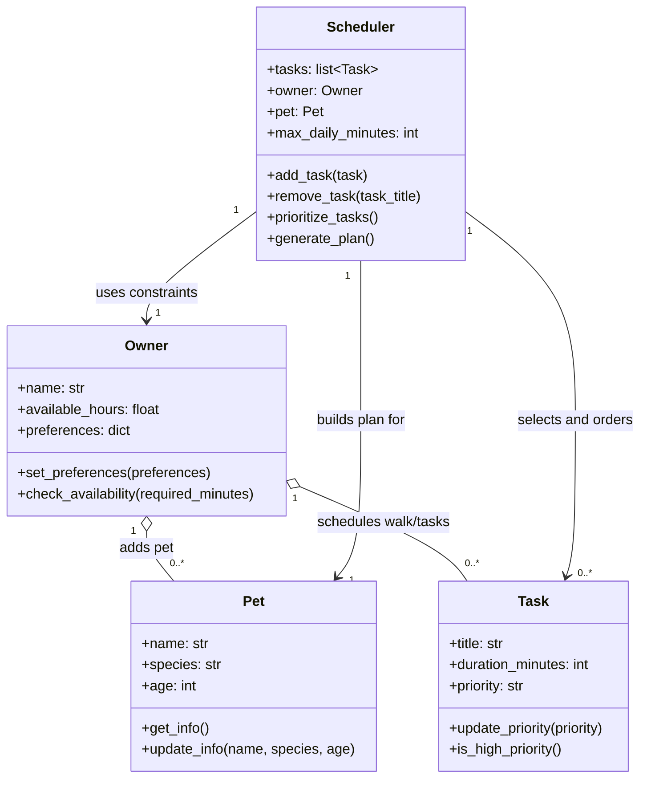

# PawPal+ Project Reflection

## 1. System Design

**a. Initial design**

Core user actions:
1. Add a pet – The user can enter and store information about their pet (name, type, age, etc.) so that the system can track and plan care activities for that pet.
2. Schedule a walk – The user can add and edit care tasks (such as walks, feeding, medication, etc.) by specifying duration and priority, allowing them to build a customized list of daily activities.
3. See today's tasks – The user can generate and view a daily schedule/plan that intelligently prioritizes their pet care tasks based on time constraints, task priority, and personal preferences, along with an explanation of why those tasks were arranged that way.

- Briefly describe your initial UML design.

Initial UML: I designed the pet care app with four classes: Pet, Owner, Task, and Scheduler. Owner owns pets and tasks, and Scheduler builds today's plan from tasks and constraints.

- What classes did you include, and what responsibilities did you assign to each?

I used four main classes to separate data from planning logic:

**Pet**
Responsibility: Store each pet's profile information used for personalized care planning.
Attributes: name, species, age.
Methods: get_info(), update_info().

**Owner**
Responsibility: Represent the human caregiver's constraints and preferences that affect scheduling.
Attributes: name, available_hours, preferences.
Methods: set_preferences(), check_availability().

**Task**
Responsibility: Model one care activity (walk, feeding, medication, etc.) with enough detail to be prioritized.
Attributes: title, duration_minutes, priority.
Methods: update_priority(), is_high_priority().

**Scheduler**
Responsibility: Generate the daily care plan by combining tasks with owner constraints and pet context.
Attributes: tasks, owner, pet, max_daily_minutes.
Methods: add_task(), remove_task(), prioritize_tasks(), generate_plan().

**b. Design changes**

- Did your design change during implementation?
- If yes, describe at least one change and why you made it.

---

## 2. Scheduling Logic and Tradeoffs

**a. Constraints and priorities**

- What constraints does your scheduler consider (for example: time, priority, preferences)?
- How did you decide which constraints mattered most?

**b. Tradeoffs**

- Describe one tradeoff your scheduler makes.
- Why is that tradeoff reasonable for this scenario?

---

## 3. AI Collaboration

**a. How you used AI**

- How did you use AI tools during this project (for example: design brainstorming, debugging, refactoring)?
- What kinds of prompts or questions were most helpful?

**b. Judgment and verification**

- Describe one moment where you did not accept an AI suggestion as-is.
- How did you evaluate or verify what the AI suggested?

---

## 4. Testing and Verification

**a. What you tested**

- What behaviors did you test?
- Why were these tests important?

**b. Confidence**

- How confident are you that your scheduler works correctly?
- What edge cases would you test next if you had more time?

---

## 5. Reflection

**a. What went well**

- What part of this project are you most satisfied with?

**b. What you would improve**

- If you had another iteration, what would you improve or redesign?

**c. Key takeaway**

- What is one important thing you learned about designing systems or working with AI on this project?
