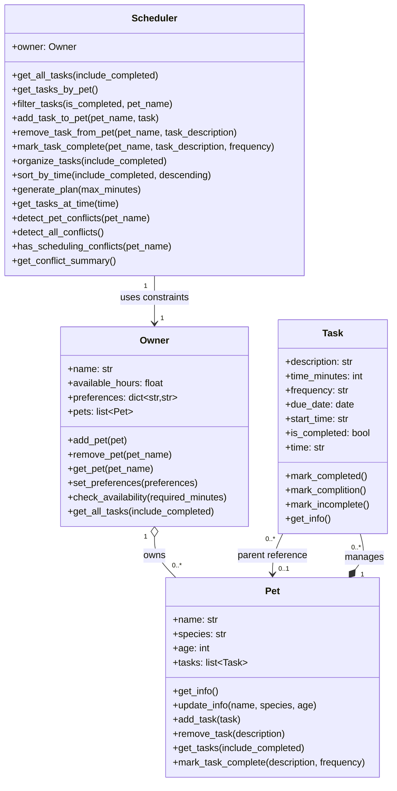

# PawPal+ Project Reflection

## 1. System Design

**a. Initial design**

Core user actions:
1. Add a pet – The user can enter and store information about their pet (name, type, age, etc.) so that the system can track and plan care activities for that pet.
2. Schedule a walk – The user can add and edit care tasks (such as walks, feeding, medication, etc.) by specifying duration and priority, allowing them to build a customized list of daily activities.
3. See today's tasks – The user can generate and view a daily schedule/plan that intelligently prioritizes their pet care tasks based on time constraints, task priority, and personal preferences, along with an explanation of why those tasks were arranged that way.

- Briefly describe your initial UML design.

Initial UML: I designed the pet care app with four classes: Pet, Owner, Task, and Scheduler. In the final implementation, Owner manages pets, each Pet manages its own tasks, and Scheduler coordinates planning/filtering/conflict checks by working through Owner.

- What classes did you include, and what responsibilities did you assign to each?

I used four main classes to separate data from planning logic:

**Pet**
Responsibility: Store each pet's profile and directly manage that pet's tasks.
Attributes: name, species, age, tasks.
Methods: get_info(), update_info(), add_task(), remove_task(), get_tasks(), mark_task_complete().

**Owner**
Responsibility: Represent caregiver constraints/preferences and manage multiple pets.
Attributes: name, available_hours, preferences, pets.
Methods: add_pet(), remove_pet(), get_pet(), set_preferences(), check_availability(), get_all_tasks().

**Task**
Responsibility: Model one care activity with scheduling, recurrence, and completion state.
Attributes: description, time_minutes, frequency, due_date, start_time, is_completed.
Methods: time (property), mark_completed(), mark_complition() alias, mark_incomplete(), get_info().

**Scheduler**
Responsibility: Coordinate task organization, filtering, plan generation, and conflict detection using Owner and Pet data.
Attributes: owner.
Methods: organize_tasks(), sort_by_time(), filter_tasks(), generate_plan(), add_task_to_pet(), remove_task_from_pet(), mark_task_complete(), detect_pet_conflicts(), detect_all_conflicts(), has_scheduling_conflicts(), get_conflict_summary().

**b. Design changes**

Yes, my design changed during implementation. The biggest change was moving task ownership to Pet (instead of Owner), adding recurrence/completion behavior directly on Task, and expanding Scheduler into an orchestration layer for filtering, ordering, planning, and conflict reporting across pets.

---

## Features Implemented

- **Input validation and normalization**: Validates task descriptions, durations, frequencies, and HH:MM start times, then normalizes user input (for example, lowercasing frequency/species and trimming whitespace).
- **Multi-key task organization**: Orders tasks using layered sorting (completion state, priority score, duration, frequency, description) for stable, consistent scheduling behavior.
- **Sort by time (HH:MM)**: Supports chronological and reverse-chronological ordering using parsed HH:MM values.
- **Priority scoring heuristic**: Uses frequency-based weights plus a short-task bonus so high-impact recurring tasks are scheduled earlier.
- **Time-constrained daily plan generation**: Builds plans within available minutes using a three-phase approach: quick wins, per-pet round-robin fairness, and final fill.
- **Recurring task rollover**: Completing daily/weekly tasks automatically creates the next occurrence with the correct future due date.
- **Ambiguity-safe task completion**: Requires frequency disambiguation when multiple pending tasks share the same description.
- **Duplicate and conflict prevention at add-time**: Blocks duplicate incomplete tasks (same description + frequency) and same-time pending tasks for the same pet/day.
- **Conflict detection and summaries**: Detects per-pet and global scheduling conflicts and generates a readable conflict report.
- **Filtering and availability checks**: Filters by completion/pet and enforces owner availability in minutes.

---

## 2. Scheduling Logic and Tradeoffs

**a. Constraints and priorities**

- What constraints does your scheduler consider (for example: time, priority, preferences)?
- How did you decide which constraints mattered most?

**b. Tradeoffs**

- Describe one tradeoff your scheduler makes.

My scheduler only checks for exact start time matches instead of detecting overlapping durations. So if a task at 10:00 AM runs 60 minutes and another starts at 10:30 AM, it won't flag a conflict even though they overlap.

- Why is that tradeoff reasonable for this scenario?

This is reasonable because users manually add tasks (not auto-scheduled), task durations are flexible, and protecting against exact conflicts is the primary concern. Full overlap detection would add complexity without much benefit.

---

## 3. AI Collaboration

**a. How you used AI**

- How did you use AI tools during this project (for example: design brainstorming, debugging, refactoring)?
- What kinds of prompts or questions were most helpful?

**b. Judgment and verification**

- Describe one moment where you did not accept an AI suggestion as-is.
- How did you evaluate or verify what the AI suggested?

---

## 4. Testing and Verification

**a. What you tested**

- What behaviors did you test?
- Why were these tests important?

**b. Confidence**

- How confident are you that your scheduler works correctly?
- What edge cases would you test next if you had more time?

---

## 5. Reflection

**a. What went well**

- What part of this project are you most satisfied with?

**b. What you would improve**

- If you had another iteration, what would you improve or redesign?

**c. Key takeaway**

- What is one important thing you learned about designing systems or working with AI on this project?
