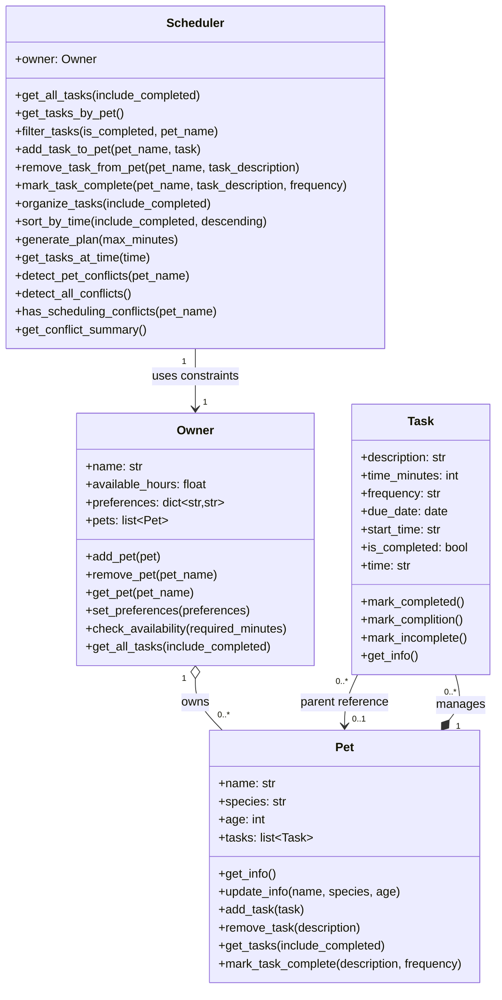

# PawPal+ Project Reflection

## 1. System Design

**a. Initial design**

Core user actions:
1. Add a pet – The user can enter and store information about their pet (name, type, age, etc.) so that the system can track and plan care activities for that pet.
2. Schedule a walk – The user can add and edit care tasks (such as walks, feeding, medication, etc.) by specifying duration and priority, allowing them to build a customized list of daily activities.
3. See today's tasks – The user can generate and view a daily schedule/plan that intelligently prioritizes their pet care tasks based on time constraints, task priority, and personal preferences, along with an explanation of why those tasks were arranged that way.

- Briefly describe your initial UML design.

Initial UML: I designed the pet care app with four classes: Pet, Owner, Task, and Scheduler. In the final implementation, Owner manages pets, each Pet manages its own tasks, and Scheduler coordinates planning/filtering/conflict checks by working through Owner.

- What classes did you include, and what responsibilities did you assign to each?

I used four main classes to separate data from planning logic:

**Pet**
Responsibility: Store each pet's profile and directly manage that pet's tasks.
Attributes: name, species, age, tasks.
Methods: get_info(), update_info(), add_task(), remove_task(), get_tasks(), mark_task_complete().

**Owner**
Responsibility: Represent caregiver constraints/preferences and manage multiple pets.
Attributes: name, available_hours, preferences, pets.
Methods: add_pet(), remove_pet(), get_pet(), set_preferences(), check_availability(), get_all_tasks().

**Task**
Responsibility: Model one care activity with scheduling, recurrence, and completion state.
Attributes: description, time_minutes, frequency, due_date, start_time, is_completed.
Methods: time (property), mark_completed(), mark_complition() alias, mark_incomplete(), get_info().

**Scheduler**
Responsibility: Coordinate task organization, filtering, plan generation, and conflict detection using Owner and Pet data.
Attributes: owner.
Methods: organize_tasks(), sort_by_time(), filter_tasks(), generate_plan(), add_task_to_pet(), remove_task_from_pet(), mark_task_complete(), detect_pet_conflicts(), detect_all_conflicts(), has_scheduling_conflicts(), get_conflict_summary().

**b. Design changes**

Yes, my design changed during implementation. The biggest change was moving task ownership to Pet (instead of Owner), adding recurrence/completion behavior directly on Task, and expanding Scheduler into an orchestration layer for filtering, ordering, planning, and conflict reporting across pets.

---

## Features Implemented

- **Input validation and cleanup**: I validate task description, duration, frequency, and HH:MM start time, then clean the input (like trimming spaces and normalizing case) so data stays consistent.
- **Consistent task ordering**: I sort tasks using multiple tie-breakers (completion state, priority score, duration, frequency, then description) so results are stable and predictable.
- **Time-based sorting**: I support sorting tasks by HH:MM in both ascending and descending order.
- **Simple priority heuristic**: I rank tasks using frequency weights plus a small bonus for shorter tasks, which helps recurring high-impact tasks show up earlier.
- **Plan generation within time limits**: I generate daily plans that stay within available minutes using three phases: quick wins, round-robin fairness across pets, and a final fill pass.
- **Recurring task rollover**: When a daily or weekly task is completed, the next occurrence is automatically created with the correct future due date.
- **Safer completion flow**: If multiple pending tasks share the same description, the user must provide frequency so the system marks the correct one.
- **Duplicate and time-conflict protection**: At add-time, I block duplicate incomplete tasks (same description + frequency) and pending same-time tasks for the same pet/day.
- **Conflict reporting**: I detect both per-pet and global scheduling conflicts and return a readable summary.
- **Filtering and availability checks**: I support filtering by completion status and pet, and I enforce owner availability in minutes.

---

## 2. Scheduling Logic and Tradeoffs

**a. Constraints and priorities**

- What constraints does your scheduler consider (for example: time, priority, preferences)?
- How did you decide which constraints mattered most?

**b. Tradeoffs**

- Describe one tradeoff your scheduler makes.

My scheduler only checks for exact start time matches instead of detecting overlapping durations. So if a task at 10:00 AM runs 60 minutes and another starts at 10:30 AM, it won't flag a conflict even though they overlap.

- Why is that tradeoff reasonable for this scenario?

This is reasonable because users manually add tasks (not auto-scheduled), task durations are flexible, and protecting against exact conflicts is the primary concern. Full overlap detection would add complexity without much benefit.

---

## 3. AI Collaboration

**a. How you used AI**

- How did you use AI tools during this project (for example: design brainstorming, debugging, refactoring)?
I mostly used AI for debugging with `pytest`. I was confused many times during the project, and when I consulted AI, it sometimes gave me wrong answers, but most of the time it gave me helpful guidance. I also used it to check my class structure (`Owner`, `Pet`, `Task`, `Scheduler`) and to make sure my scheduling logic was clean. It helped me think step by step when I got stuck with conflict detection and recurring tasks.
- What kinds of prompts or questions were most helpful?
AI is a tool, and I believe if you guide it properly and know how to use it, it can help solve problems effectively. The most helpful prompts for me were about debugging and writing efficient code. I asked things like: why my test is failing, how to avoid duplicate tasks, and how to rank tasks by priority without breaking other features. Prompts with clear context from my code gave me better answers.

**b. Judgment and verification**

- Describe one moment where you did not accept an AI suggestion as-is.
In this UI session, I had to import the four core classes, but AI gave me imports from different files. It looked awkward to me, so I changed it manually in my code.
- How did you evaluate or verify what the AI suggested?
During my first semester, I took a backend course, so I used that knowledge to evaluate what AI suggested. I did not trust every answer directly. I verified it by running the code, checking `pytest` results, and comparing the output with my expected behavior.

---

## 4. Testing and Verification

**a. What you tested**

- What behaviors did you test?
- Why were these tests important?

I tested core behaviors from my project: task add/remove flow, mark complete flow, recurring task creation for daily/weekly, sorting by time (ascending and descending), filtering by completion and pet name, conflict detection, and plan generation when there are no tasks. I also tested edge cases like duplicate tasks and same-time conflicts.

These tests were important because my app is mostly logic-based. If one logic part breaks, the plan can be wrong for the user. Testing helped me confirm that my scheduler works in a predictable way and that new features did not break old behavior.

**b. Confidence**

- How confident are you that your scheduler works correctly?
- What edge cases would you test next if you had more time?

I am confident at a good level because I ran `pytest` many times and the main workflows passed. I also checked both normal cases and failure cases.

If I had more time, I would test more edge cases like overlapping duration conflicts (not only exact same start time), very large task lists, and cases where available time is very small but tasks have very high priority.

---

## 5. Reflection

**a. What went well**

- What part of this project are you most satisfied with?
I had never made an app before, so this project means a lot to me. I am really happy to see the final result. Before this, coding felt like magic, but now I understand it is mostly logic and problem-solving, and you need to know how to apply it step by step.

**b. What you would improve**

- If you had another iteration, what would you improve or redesign?
If I had another iteration, I would improve conflict handling by checking overlapping durations, not only exact same start times. I would also improve the UI flow to make task input and editing more user-friendly, and add clearer explanations for why each task is selected in the daily plan.

**c. Key takeaway**

- What is one important thing you learned about designing systems or working with AI on this project?
My key takeaway is that AI can support me well, but I still need to use my own judgment and verify everything with tests. I learned that good system design and clear logic make debugging easier, and writing small test cases gives me confidence in my code.
